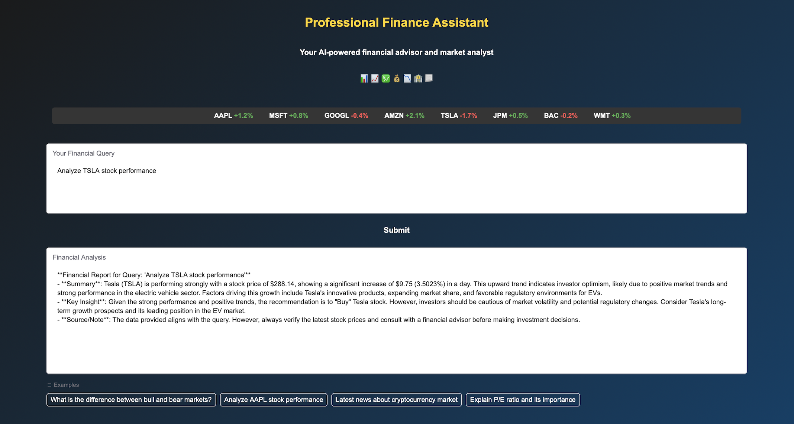

# Finance Chatbot

## Screenshot


## Live Demo

[Hugging Face Space](https://huggingface.co/spaces/Ardaarslan02/finance-chatbot) - Experience the Finance Chatbot directly in your browser!

## Overview

The **Finance Chatbot** is an AI-powered financial assistant designed to provide insights into financial concepts, market news, and stock analysis. Built with **Gradio** for a user-friendly web interface, **CrewAI** for agent-based workflows, and **Qdrant** for retrieval-augmented generation (RAG), the chatbot combines preloaded financial documents with real-time web data to deliver accurate, concise, and professional responses.

It supports three main query types: general finance knowledge, market news, and stock analysis. The chatbot features a modern, dark-themed interface with a stock ticker tape, interactive input/output fields, and example queries for ease of use.

It leverages **Mistral** (`mistral-large-latest`) for query classification and **Gemini** (`gemini-2.0-flash`) for other agent tasks, ensuring efficient and high-quality responses. By utilizing **CrewAI**, the system efficiently manages multiple AI agents, enabling scalable, robust, and responsive performance.

Information retrieval is enhanced by combining RAG data from financial documents (`Basics.pdf`, `Statementanalysis.pdf`, `Financialterms.pdf`) with real-time web search results, ensuring comprehensive and up-to-date answers.

## Features

- **General Finance Knowledge**: Answers questions about financial terms and concepts (e.g., "What is the balance of payments?").
- **Market News**: Summarizes recent financial news and provides actionable insights.
- **Stock Analysis**: Analyzes specific stocks with basic technical insights (e.g., "Analyze AAPL").
- **Interactive UI**: Built with Gradio, featuring a ticker tape, input/output boxes, and example queries.
- **RAG Integration**: Uses Qdrant to retrieve relevant information from preloaded financial documents, combined with web search results for comprehensive responses.
- **CrewAI-Powered**: Leverages the CrewAI framework for efficient multi-agent workflows, enabling seamless task delegation and response generation.

## Prerequisites

Before running the project, ensure you have the following:

- Python installed (the project will work with your current Python version).
- A Qdrant instance with a collection named `finance-chatbot` containing financial documents.
- API keys for the following services:
  - **Qdrant**: For RAG data retrieval.
  - **Mistral AI**: For the LLM used for query classification.
  - **Gemini**: For the LLM used by the primary analysis agents.
  - **Alpha Vantage**: For stock data.
  - **Serper API**: For web search/news fetching.
- Jupyter (optional, if running `setup_qdrant.ipynb` locally).

## Setup Instructions

1. **Clone the Repository**:
   ```bash
   git clone <repository-url>
   cd finance-chatbot
   ```

2. **Install Dependencies**:
   ```bash
   pip install -r requirements.txt
   ```

3. **Set Up Environment Variables**:
   Create a .env file in the project root and add the following API keys:
   ```
   QDRANT_API_KEY=<your-qdrant-api-key>
   QDRANT_URL=<your-qdrant-url>
   MISTRAL_API_KEY=<your-mistral-api-key>
   GEMINI_API_KEY=<your-gemini-api-key>
   ALPHA_VANTAGE_API_KEY=<your-alpha-vantage-api-key>
   SERPER_API_KEY=<your-serper-api-key>
   ```
   Replace `<your-...>` with your actual API keys.

4. **Set Up Qdrant Collection**:
   - Ensure your Qdrant instance is running.
   - Download the following financial PDFs to the Data/ directory:
     - [Basics.pdf](https://www.researchgate.net/publication/329751607_Basics_of_Finance)
     - [Statementanalysis.pdf](https://charteredonlineupload.wordpress.com/wp-content/uploads/2011/12/financial-statement-analysis-lifa.pdf)
     - [Financialterms.pdf](https://www.plainenglish.co.uk/files/financialguide.pdf)
   - Run the setup_qdrant.ipynb notebook to create and populate the finance-chatbot collection:
   ```bash
   jupyter notebook setup_qdrant.ipynb
   ```
   - Follow the notebook steps to load PDFs, split them into chunks, generate embeddings using sentence-transformers/all-MiniLM-L6-v2, and upload them to Qdrant. The notebook confirms successful loading of 3 PDFs and 547 pages, split into 2756 text chunks.

## Usage

1. **Run the Chatbot**:
   - **Web Interface**: Launch the Gradio interface:
   ```bash
   python interface.py
   ```
   This will start a local server, typically at http://127.0.0.1:7860. Open this URL in your browser to access the chatbot.
   
   - **Terminal Testing**: Test the agent functionality locally:
   ```bash
   python main.py
   ```
   This allows you to test the CrewAI agents directly without the web interface.

2. **Interact with the Chatbot**:
   - General Finance Questions: Type queries like "What is the balance of payments?" or "Explain P/E ratio."
   - Market News: Ask for recent news, e.g., "Latest news about cryptocurrency market."
   - Stock Analysis: Request stock analysis, e.g., "Analyze AAPL stock performance."
   - Use the example buttons at the bottom for quick queries.

3. **View Responses**:
   Responses are displayed in the "Financial Analysis" box in a professional report format, including a summary, key insight, and source/note.

## File Structure

- `app.py`: Sets up the Gradio interface, including the UI design, ticker tape, and event handlers.
- `main.py`: Command-line script for testing the agent functionality locally.
- `tasks.py`: Defines tasks for different query types (finance knowledge, market news, stock analysis, response refining).
- `agents.py`: Defines the AI agents (Finance Knowledge Expert, Market News Analyst, Stock Analysis Expert, Response Refiner) used by CrewAI.
- `utils.py`: Contains utility functions for Qdrant search, web search (Serper API), stock data fetching (Alpha Vantage), and query classification.
- `setup_qdrant.ipynb`: Jupyter notebook for setting up the Qdrant collection.
- `Data/`: Directory containing financial PDFs.
- `.env`: Stores environment variables (API keys).
- `requirements.txt`: Lists project dependencies.
- `README.md`: Project documentation.

## Example Queries

- **Finance Knowledge**: "What is the balance of payments?"
  - Response: A summary of the BOP, its structure, and its impact on a country's economy.
- **Market News**: "Latest news about cryptocurrency market"
  - Response: A summary of recent crypto news with an actionable insight for investors.
- **Stock Analysis**: "Analyze AAPL stock performance"
  - Response: An analysis of Apple's stock price, trends, and an investment recommendation.

## Troubleshooting

- **Gradio Interface Not Loading**: Ensure interface.py is running and check the console for errors. Verify that port 7860 is not in use.
- **API Errors**:
  - Qdrant: Check your Qdrant URL and API key in .env. Ensure the finance-chatbot collection exists.
  - Mistral AI: Verify your Mistral API key.
  - Gemini: Verify your Gemini API key.
  - Alpha Vantage/Serper: Check API keys and ensure you haven't exceeded rate limits.
- **RAG Data Not Used**: If RAG data isn't being used, verify that the Qdrant collection contains relevant documents and that embeddings are correctly set up.
- **Jupyter Notebook Issues**: Ensure jupyter is installed (pip install jupyter) and run setup_qdrant.ipynb in a compatible Python environment.

## Contributing

Contributions are welcome! To contribute:

1. Fork the repository.
2. Create a new branch (git checkout -b feature/your-feature).
3. Make your changes and commit (git commit -m "Add your feature").
4. Push to your branch (git push origin feature/your-feature).
5. Open a pull request.

## License

This project is licensed under the MIT License. See the LICENSE file for details.

## Acknowledgments

* **Gradio**: For the user-friendly interface framework.
* **CrewAI**: For its powerful agent-based task management, enabling efficient multi-agent workflows.
* **Qdrant**: For efficient vector search and RAG capabilities.
* **Mistral AI**: For the powerful LLM used for query classification.
* **Gemini:**: For the advanced LLM powering the core analysis agents.
* **Alpha Vantage** and **Serper API**: For providing stock data and web search capabilities.
* **LangChain**: For seamless integration with Qdrant and HuggingFace embeddings.
